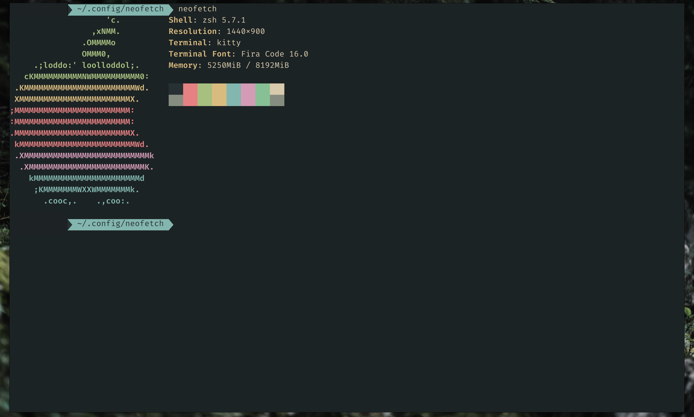

# forest-all-nighter-kitty

[](https://github.com/RichardLitt/standard-readme)

A port of [huytd's](https://github.com/huytd) [Forest All Nighter theme](https://github.com/huytd/vscode-forest-all-nighter) for [kitty](https://sw.kovidgoyal.net/kitty/).



## Install

Download `forest-all-nighter.conf` and place it under `~/.config/kitty/`

```conf
# ~/.config/kitty/kitty.conf

include forest-all-nighter.conf
```

## Related

- [sainnhe/forest-night](https://github.com/sainnhe/forest-night)
- [sainnhe/forest-night-vscode](https://github.com/sainnhe/forest-night-vscode)
- [huytd/vscode-forest-all-nighter](https://github.com/huytd/vscode-forest-all-nighter)
- [jef/forest-night-iterm](https://github.com/jef/forest-night-iterm)
- [huytd/nvim-forest-all-nighter](https://github.com/huytd/nvim-forest-all-nighter)

## License

[MIT](./LICENSE) © Brian Greenwood
